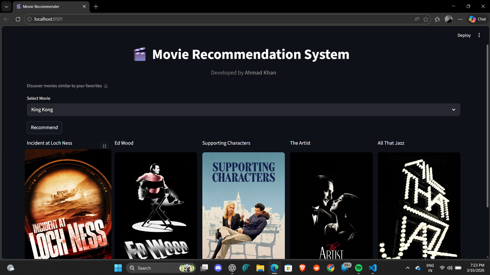

# 🎬 Movie Recommendation System

A **content-based movie recommendation system** built using **Python, Scikit-learn, and Streamlit**.
The system recommends movies similar to the one selected by the user using **cosine similarity** on movie metadata.

---
## 👨‍💻 Developer

**Ahmad Khan**

GitHub:
https://github.com/bytewithahmad


## 🚀 Features

* Recommend similar movies instantly
* Content-based filtering using machine learning
* Movie posters fetched using **TMDB API**
* Interactive user interface built with **Streamlit**

---

## 🛠 Tech Stack

* Python
* Pandas
* NumPy
* Scikit-learn
* Streamlit
* TMDB API

---

## 📂 Project Structure

```
Movie-Recommendation-System
│
├── app.py                # Streamlit application
├── model.py              # Model building script
├── dataset
│   ├── tmdb_5000_movies.csv
│   └── tmdb_5000_credits.csv
│
├── requirements.txt      # Python dependencies
├── output.png            # Screenshot of the app
├── .gitignore
└── README.md
```

---

## ⚙️ Installation

Clone the repository

```
git clone https://github.com/bytewithahmad/Movie-Recommendation-System.git
```

Move into the project folder

```
cd Movie-Recommendation-System
```

Install dependencies

```
pip install -r requirements.txt
```

---

## ▶️ Run the Project

Generate the model files

```
python model.py
```

Start the Streamlit app

```
streamlit run app.py
```

---

## 📸 Screenshot



---

## 📌 How It Works

1. Movie dataset is processed using **Pandas**
2. Important features like **genres, cast, keywords and overview** are combined
3. **CountVectorizer** converts text into vectors
4. **Cosine similarity** calculates similarity between movies
5. Streamlit interface displays recommended movies with posters

---

